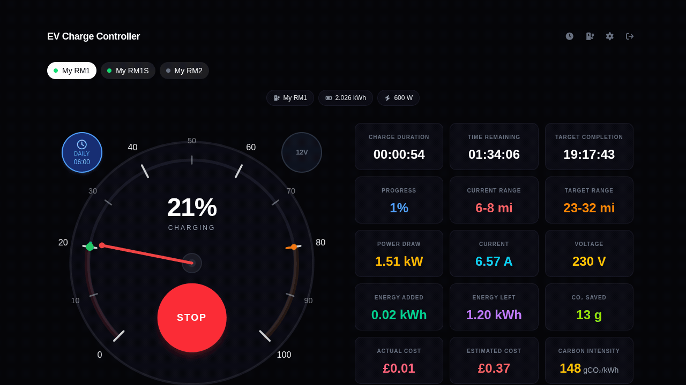

# EV Charge Controller

[](https://github.com/TheRyanHowell/ev-charge-controller/actions/workflows/ci.yml)

A full-stack IoT system that turns a [Tasmota](https://tasmota.github.io) smart
plug into a smart EV charger for [Maeving](https://maeving.com) electric
motorbikes. It pairs a speedometer-inspired dashboard with a Go control plane
that handles scheduling, carbon-aware charging, cost tracking, and real-time
telemetry over MQTT.

> **Status:** active personal project, built for my own personal use. It is not
> intended for critical infrastructure or safety-critical use.



## Why it exists

Lithium-ion batteries last longest when kept between 20% and 80% state of charge.
Deep discharges and sustained full charges accelerate degradation. This project
makes it easy to keep your electric motorcycle batteries in that sweet spot: the
speedometer gauge shows exactly where you are, charge targets let you stop at 80%,
and push notifications tell you when the battery hits your desired level.

Maeving motorbikes ship with removable batteries and a plain mains charger. There
is no app, no scheduling, no way to know how much a charge cost or how clean the
electricity was. This project adds all of that on top of a cheap Tasmota smart
plug: plug the charger into the plug, and the system measures energy at the wall,
infers battery state of charge, schedules charging for the cheapest/greenest
hours, and tells you when it is done, all scoped per bike and per user.

## Features

- **Speedometer SoC gauge** - a canvas gauge with draggable start, current, and
  target markers. Drag to set a charge target; watch the needle sweep as the
  battery fills.
- **Live charging telemetry** - real-time power draw, voltage, current, energy
  added, and estimated state of charge, streamed from the plug over MQTT.
- **Carbon-aware scheduling** - charge inside a window so the bike is ready by a
  deadline, using the cheapest, greenest half-hours from the UK Carbon Intensity
  forecast. Plus simple daily timers.
- **Cost & carbon accounting** - per-session and lifetime cost (in pence) from
  your electricity tariff, off-peak energy tracking, and grams of CO2 per session.
- **Charge history & charts** - browse past sessions with power, state-of-charge,
  current, and carbon-intensity charts.
- **Multi-bike, multi-user** - manage several bikes and plugs; all data is scoped
  per authenticated user.
- **12V maintenance plugs** - a separate plug type for trickle-charging the 12V
  accessory battery, toggled directly from the dashboard.
- **Push notifications** - get notified on charge completion or when a plug drops
  offline (per-bike preferences, requires HTTPS).
- **Zero-touch plug setup** - a first-run wizard provisions MQTT credentials and
  can auto-configure the Tasmota device over HTTP.
- **PWA** - installable, secure-context push support via the optional
  Caddy/HTTPS path.

## Tech stack

- **Backend:** Go 1.26, `net/http` method-routing mux, SQLite (`modernc.org/sqlite`)
- **Frontend:** Next.js 16 (App Router), TypeScript, Tailwind, React Query, Zustand
- **Messaging:** Mosquitto MQTT broker with dynamic-security per-user ACLs
- **Hardware:** Tasmota smart plugs (energy monitoring + relay)
- **Testing:** Vitest (unit), Playwright (E2E, Chromium + Firefox)
- **Infra:** Docker Compose, optional Caddy reverse proxy (HTTPS via Cloudflare DNS)

See **[docs/ARCHITECTURE.md](docs/ARCHITECTURE.md)** for the full design, and
**[docs/TESTING.md](docs/TESTING.md)** for the testing and manual-verification guide.

## Components

- **Next.js UI** - dashboard, gauge, charts, history, plug/vehicle management, push
- **Go API** - REST backend for users, bikes, plugs, sessions, schedules, tariffs,
  carbon data, and Tasmota control, plus background scheduling/polling workers
- **Mosquitto MQTT broker** - real-time plug telemetry (energy, LWT availability)
- **Mock Tasmota** - a simulated plug with a realistic CC/CV charge curve, so the
  whole stack runs end-to-end without any hardware
- **Playwright E2E suite** - full browser tests (Chromium + Firefox) covering all
  critical user flows against the live stack with mock Tasmota
- **Caddy reverse proxy** - optional HTTPS via Let's Encrypt with the Cloudflare
  DNS-01 challenge

## Getting Started

### Prerequisites

- [Docker](https://www.docker.com/) with the Compose plugin

### Configuration

Copy `.env.example` to `.env` and adjust values. See [.env.example](.env.example)
for all variables.

```bash
cp .env.example .env
```

### Running

**Always use the [`Makefile`](Makefile) to manage containers.**

```bash
make dev          # Start API + UI + mock Tasmota (development mode, hot-reload)
make start        # Start API + UI (+ Caddy HTTPS if ENABLE_HTTPS=true)
make stop         # Stop all containers
make logs         # Follow logs from all containers
make seed         # Reset the DB and load a rich demo dataset
make test-api     # Run Go API tests
make test-e2e     # Run Playwright E2E tests (Chromium + Firefox)
make test-ui      # Run Next.js unit tests
make clean        # Remove containers, volumes, images
```

Ports: **UI** -> 3000, **API** -> 8080, **Mock Tasmota** -> 8081 (dev only),
**MQTT** -> 1883.

Development mode runs the Go API with [Air](https://github.com/air-verse/air)
live-reload, the Next.js UI with Turbopack hot-reload, and a mock Tasmota server
so you can use the whole app without hardware.

### Try it with demo data

The fastest way to see the app is the seeded demo dataset (one user, three bikes,
smart plugs, a UK electricity tariff, and hundreds of historical charge sessions
with full charts):

```bash
make dev
make seed
# then open http://localhost:3000 and log in:
#   email:    test@example.com
#   password: password123
```

### Creating your own user

```bash
make create-user EMAIL=you@example.com
```

You will be prompted for a password (masked input). Then log in at
`http://localhost:3000`. You can also register via the API:

```bash
curl -X POST http://localhost:8080/api/auth/register \
  -H 'Content-Type: application/json' \
  -d '{"email":"you@example.com","password":"yourpassword"}'
```

### HTTPS / TLS (optional)

Push notifications and PWA install require a secure context. Optional HTTPS is
provided by a Caddy reverse proxy using the Let's Encrypt DNS-01 challenge via
Cloudflare. See **[docs/HTTPS.md](docs/HTTPS.md)** for the full setup guide.

## AI Disclosure

The majority of this project was created with the [OpenCode](https://opencode.ai)
harness and [Qwen 3.6](https://github.com/QwenLM/Qwen3.6)
[27B FP8](https://qwen.ai/blog?id=qwen3.6-27b) /
[35B A3B FP8](https://qwen.ai/blog?id=qwen3.6-35b-a3b).

[Claude Code](https://claude.com/product/claude-code) was used to polish some more
complex areas with [Sonnet 4.6](https://www.anthropic.com/news/claude-sonnet-4-6)
and [Opus 4.8](https://www.anthropic.com/news/claude-opus-4-8).

These agents produced the majority of the code, but design and architecture
decisions remain in control of the author.

## License

Distributed under [AGPL-3.0-only](LICENSE).
